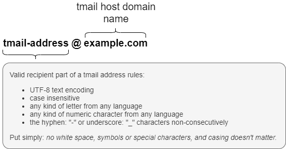

# Thread-Mail
 Thread-mail, often abbreviated: tmail, is a messaging protocol built on HTTP. Messages are _relational_ (hence “Thread” in the name) in that they know their parent they are in reply to (using a blockchain identifier), and _topic orientated_ in that each message pertains to a particular topic. 

A tmail host (which below [specification](#specification) defines) is the only requirement to setup a full functioning tmail service. Many additional services can compliment a tmail host adding their special function. Some tmail service implementations are:

- [tmail-host](https://github.com/markmnl/tmail-host) — HTTP API, canoncial implementation of a tmail host, requires a tmail-store
- tmail-id — user identity management service
- tmail-webapi — HTTP API for exchange of messages between client and host, requires a tmail-store and tmail-id
- tmail-chalkboard — basic web user interface, requires tmail-webapi 
- tmail-noticeboard — web user interface designed to present messages on big display, requires tmail-webapi 
- tmail-cmd — command line interface client for sending and retrieving messages from tmail-webapi
- [tmail-store](https://github.com/markmnl/tmail-store) — common interface defining storage, retrival, searching, etc. of messages
    - [tmail-store-stdout](https://github.com/markmnl/tmail-store-stdout)
    - tmail-store-postgres
    - tmail-store-bigtable
    - tmail-store-git
- tmail-squawk — notification service via web socket
- tmail-police — spam filtering service utilising an arsenal of spam busting tactics
- tmail-foghorn — spam generating service
- tmail-mugshot — user avatar management service
  
## Features
- **User experience** — presentation of messages especially hierarchies from multiple replies can be presented intuitively by clients making use of the relational model and topics.
- **Spam prevention** — replies can be validated to have been in reply to a message using the blockchain identifier. (All messages except the first message initiating a topic are replies). 
- **Efficiency** — less data transferred because only the last message in a thread needs to be sent. Unlike email clients today which concatenate mail chains in different ways. 
- **Attachments** — any files can be attached to a message, at the discretion of the host.

## Motivation
Thread-Mail (tmail) is a public specification anyone can implement maintaining a key feature of email today: unsolicited messages — allowing anyone to send a message to anyone else given only the recipient's address. Anyone can stand up their own host for their domain to have control and ownership of messages sent and received from that host (i.e. tmail is not owned by anyone). Built with contemporary, ubiquitis technologies today such as: HTTP, DNS and JSON, allows tmail's specification to be relatively small — lending itself to maintainability, adoption and security.

## Key Criteria
- **Open public API**. A tmail host can send messages to any other tmail host on the same network.
- **Undefined private API**. Exchange between client and host is intentionally left undefined. Common implementations can rise and fall on their own merit, such as tmail-webapi.

## Specification
 
### Address
 
 
### Public API
A tmail host has one HTTP endpoint to which a JSON message is posted: `/tmail/v1`. For example:
 
```
POST /tmail/v1 HTTP/1.1
Host: foo.example
Content-Type: application/json
Content-Length: 27
 
{
	"id": null,
	"pid": null,
	"from": "markmnl@threadster.appspot.com",
	"to": "mia323@threadster.appspot.com",
	"time": 1579706539,
	"topic": "genisis",
	"content": "The quick brown fox jumps over the lazy dog."
}
```
 
That's it! Senders should treat the HTTP response in the normal way, i.e. a successful response would be `201 Created` meaning the message has been received.
 
### Message Data Definition
Messages MUST be within definition; otherwise SHOULD be rejected upon receipt. See [tmail JSON Message Schema](msgschema.json).
 
### Attachments
 

